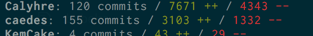

# Git Author Stats

_Provide interesting statistics about Git authors on a single repository._

## Getting Started

Install:

```shell
npm install git-author-stats
```

Run the command:

```shell
git-author-stats
```

And obtain result as below:



## License

[MIT License](LICENSE.md)
